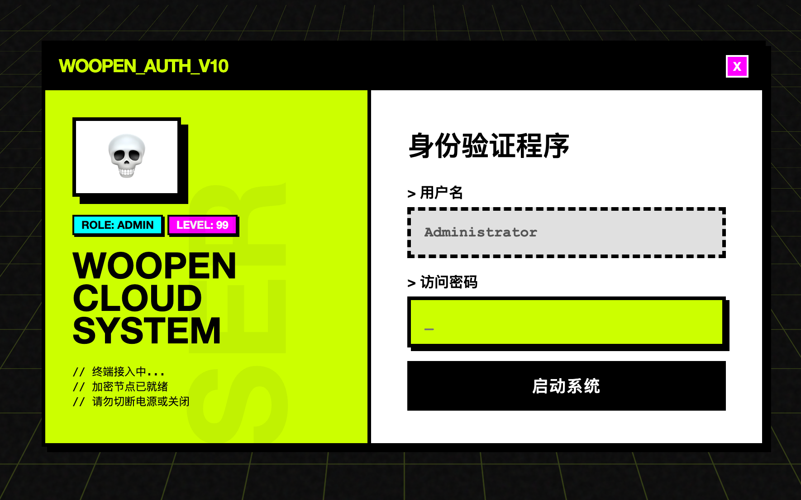
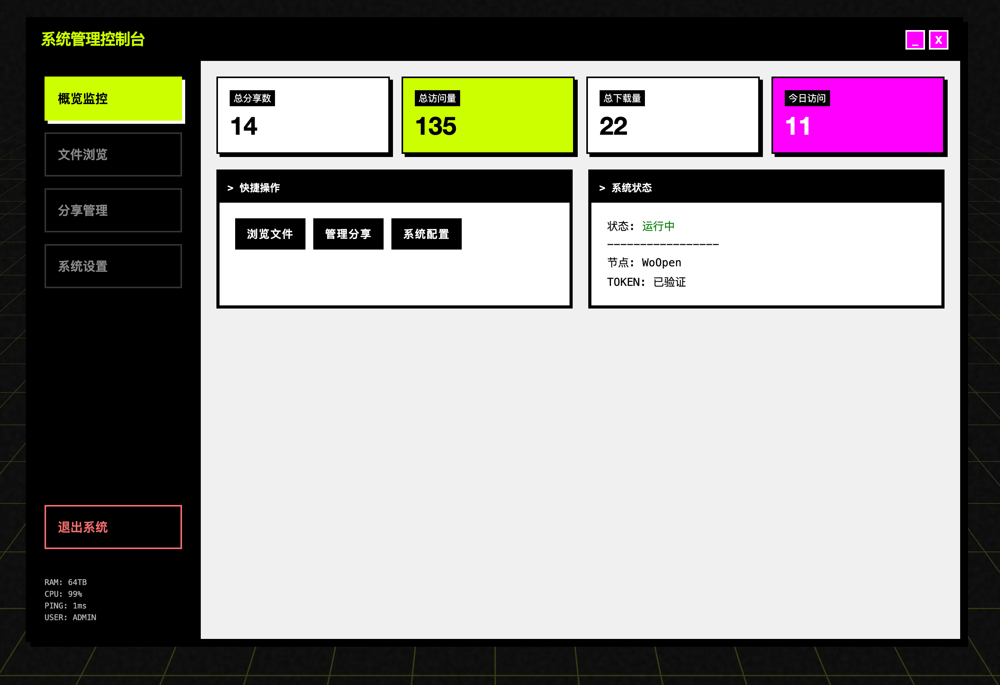
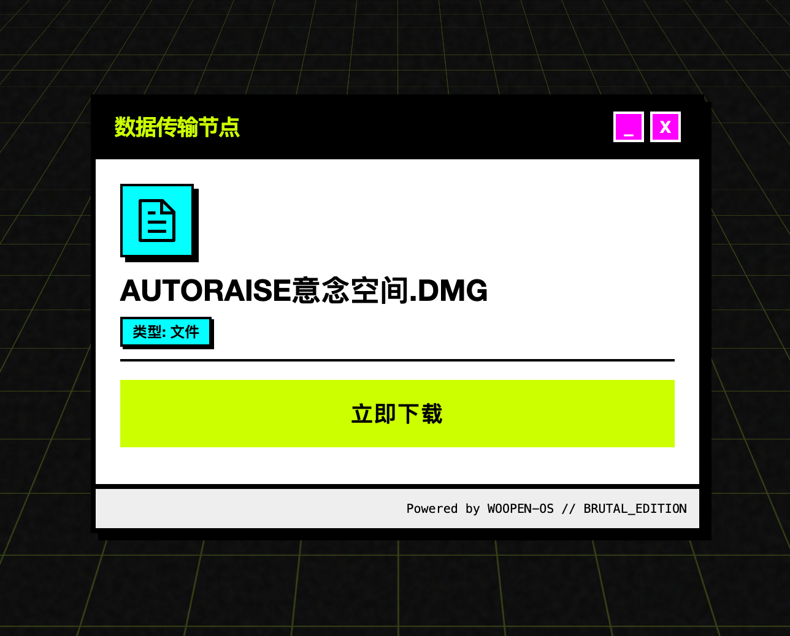
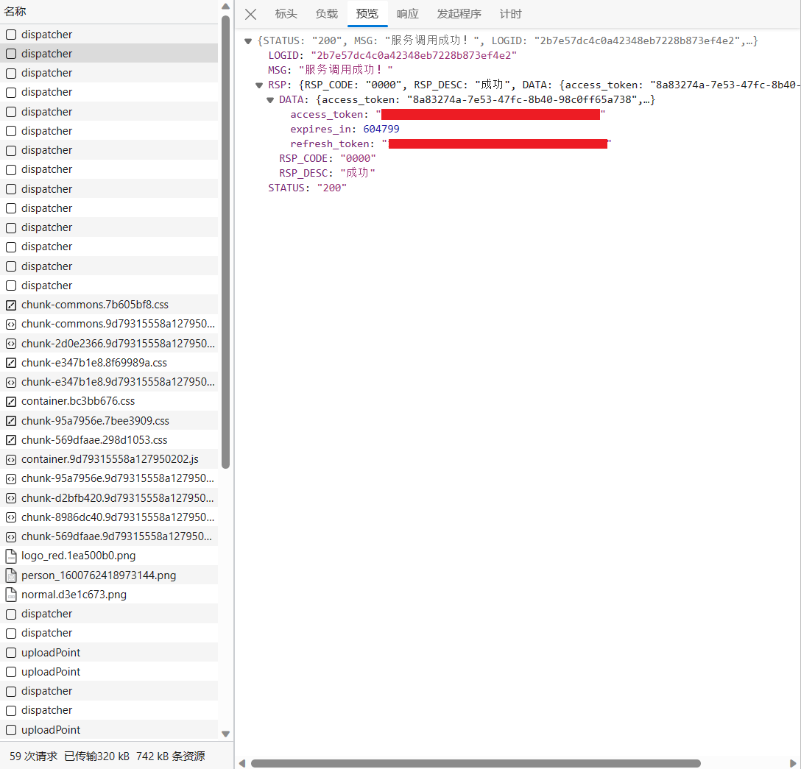

# WoOpen

> 联通云盘直链分享工具。生成一个链接，别人点开就能下载，完事。

<br>

## 这玩意怎么来的

我手上有个联通云盘会员，还有 11 年才到期，别问怎么来的，问就是一元一年买多。

平时根本用不上，放着吃灰又可惜。

想着能不能搞个工具分享文件给朋友？试了 Alist、Cloudreve 这些，感觉不太对。

我就一个联通云盘，用那些功能太多了，而且它们更像是「个人网盘站」，打开能看到文件列表和其他分享，我不想暴露这些，加密又太麻烦了。

我的需求很简单：发个链接，对方只能看到我分享的这一个文件，其他啥也看不到（类似于百度网盘）。

所以就自己写了一个。

<br>

## 功能

| 功能 | 说明 |
| --- | --- |
| 直链分享 | 文件/文件夹生成分享链接 |
| 访问控制 | 可以加密码、设过期时间、限制下载次数 |
| 自定义短链 | 比如 `/s/movie` |
| 访问统计 | 后台能看访问量 |
| 过期提醒 | Token 快过期会推送通知，支持 Bark、微信、Telegram 这些 |

<br>

## 预览

**登录页面**



**后台管理**



**分享页面**



<br>

## 部署

### 先拿到联通云盘的 Token

打开 https://pan.wo.cn/ 登录账号

按 `F12` 打开开发者工具，切到「网络」标签，刷新页面

找到带 `dispatcher` 的请求：

点进去看响应，找到 `token` 字段，复制出来：



> 这个 token 先存着，等下要填两遍。

<br>

### 方式一：拉镜像（推荐）

SSH 连上服务器：

```bash
mkdir -p /opt/woopen && cd /opt/woopen
```

创建 `docker-compose.yml`：

```bash
nano docker-compose.yml
```

粘贴以下内容，**密码记得改**：

```yaml
version: '3.8'

services:
  woopen:
    image: ghcr.io/wp-x/woopen:latest
    container_name: woopen
    ports:
      - "10010:10010"
    volumes:
      - ./data:/data
    environment:
      - WOOPEN_ADMIN_PASSWORD=改成你的密码
      - WOOPEN_PORT=10010
      - TZ=Asia/Shanghai
    restart: unless-stopped
```

保存退出，启动：

```bash
docker-compose up -d
```

浏览器打开 `http://服务器IP:10010`

<br>

### 方式二：本地构建

适合想改代码的，把仓库拉下来构建：

```bash
cd /opt
git clone https://github.com/wp-x/woopen.git
cd woopen
```

改一下 `docker-compose.yml` 里的密码，然后：

```bash
docker-compose up -d --build
```

浏览器打开 `http://服务器IP:10010`

<br>

### 填 Token

登录后台，进「系统设置」，找到「刷新令牌」和「访问令牌」两个框。

把刚才复制的 token 粘贴两次，对，**两个框填一样的**。联通的接口就这样设计的。

保存，去「文件管理」看看能不能加载出文件列表，能的话就成了。

<br>

## 环境变量

| 变量 | 说明 | 默认 |
| --- | --- | --- |
| `WOOPEN_ADMIN_PASSWORD` | 登录密码 | admin123 |
| `WOOPEN_PORT` | 端口 | 10010 |
| `WOOPEN_SITE_URL` | 域名 | 空 |

<br>

## Nginx 反代

有域名的话可以配一下：

```nginx
server {
    listen 80;
    server_name pan.example.com;

    location / {
        proxy_pass http://127.0.0.1:10010;
        proxy_set_header Host $host;
        proxy_set_header X-Real-IP $remote_addr;
    }
}
```

HTTPS 用 certbot 或者套 Cloudflare。

<br>

## FAQ

**Token 多久过期？**

不固定，设置里可以开监控，过期了会推送通知。

**两个 token 为啥填一样的？**

联通云盘接口设计如此。

**支持其他网盘吗？**

不支持，只能联通云盘。

<br>

## 参考项目

| 项目 | 说明 |
| --- | --- |
| [Alist](https://github.com/alist-org/alist) | 支持多种网盘的文件列表程序，功能全面 |
| [OpenList](https://github.com/OpenListTeam/OpenList) | Alist 的活跃 Fork，持续维护中 |

<br>

## License

MIT
